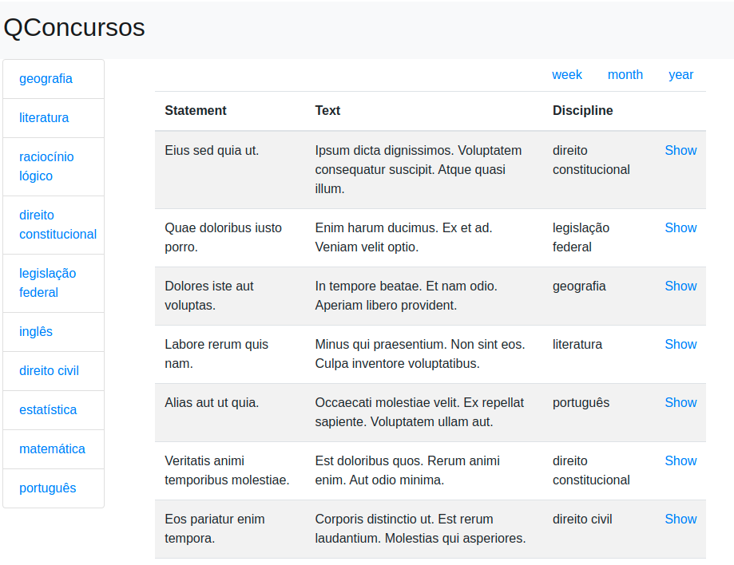

# QConcursos-Challenge

Tools | Versions
--------- | ------
ruby        | 2.7.1 alpine
rails       | 6.0
node        | 12.22.6

This project also includes a Postgres relational database and a Redis database used for caching.

## Running Locally
(The database is automatically created/migrated but you will have to populate 
the database in order to not raise any errors, follow the steps to database population)
### Build development instructions

- docker-compose up -d

### Database population

The project includes a container responsible for the migration of the development database.

The project includes a task responsible for loading the available Json files.

to load the database:

- `docker-compose run --rm web bin/rails database:import_data`

to clean the database:

- `docker-compose run --rm web bin/rails database:clean`

### Running tests

- `docker-compose run --rm web bin/rails db:create RAILS_ENV=test`
- `docker-compose run --rm web bin/rails db:migrate RAILS_ENV=test`
- `docker-compose run --rm  web bundle exec rspec`

## Project decisions

### Structure

Query Objects were used to encapsulate the Most Viewed and Hot Topics queries. (are in: "app/queries/*")

The Policy Pattern was used to encapsulate the decision of when to cache the query response. (they are in: "app/policies/*")

### Caching
(rails has a caching system, it was handcrafted here to show another approach to caching, allowing for fine grain tuning)

Due to the large number of accesses described in the challenge, it was decided to use a cache bank to save the query response, reducing the response time and the number of requests made to the bank.

- Low-level-caching was used using a redis database.
- The first 10 pages of each search will be cached.
- Cache expires in 2 minutes.

### QueryObjects
Query objects return a relation, so they can be used in conjunction with other filters,
as seen in the project using topics with MostViewed and pagination.

### Notes
- The questions JSON file provided has 48 duplicate keys. When loading the database the duplicate keys are logged in 'log/import.log'

- The database structure provided mixes characteristics of different entities. 
Removing the field "daily access" from the entity "Questions" and moving it to the entity "QuestionAccesses" along with an attribute for the day. 
Queries can be filtered and grouped in a way more efficient.

- The project has already defined serializers, so the use with a frontend application using javascript is already possible.
To increase system performance, splitting the system into frontend/backend applications is an option, which makes application rendering no longer the responsibility of the backend server increasing disponibility.

-  How and when to use cache as well as system choices is a question of data about the application, these can be obtained by tools like nagios, cactis among others.
 
- Having a sense of how the system works, as an example, knowing which pages are most accessed allow us to use different approaches, such as defining a cache using cluster(shards) or primary/replica replication
### Passwords

Database and pgadmin passwords are defined in .env/development

## Project Running

The project is a site for displaying pre-registered questions, the menu on the left has filters for all disciplines 
registered in the question bank. 
There is also available a filter by period returning the questions by the last weeks, month or year

